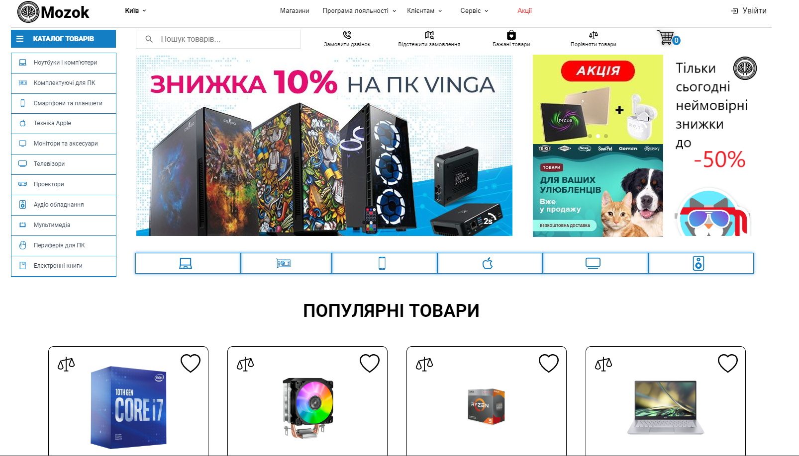
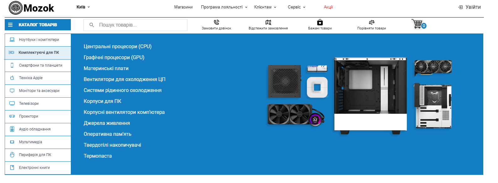
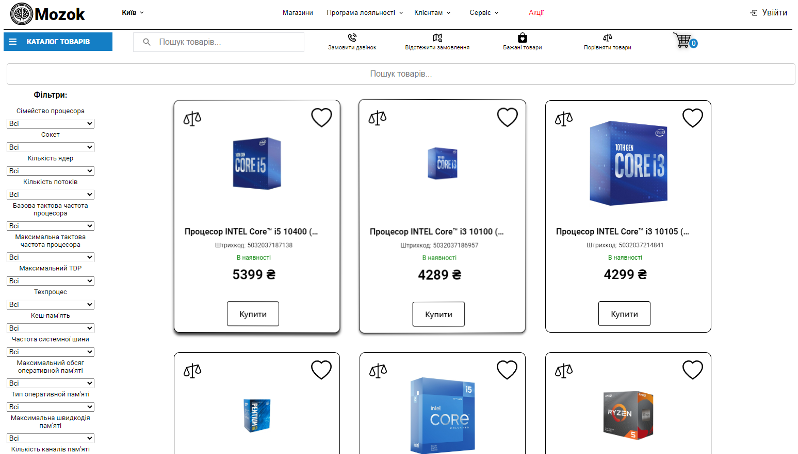
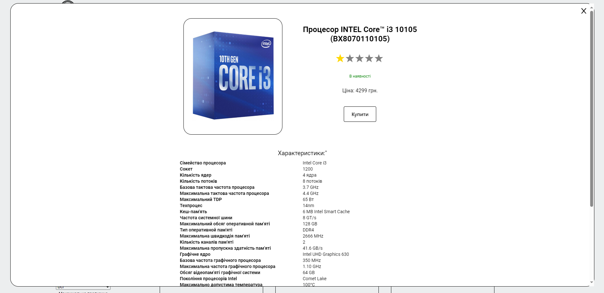

# Mozok

**Ласкаво просимо до репозиторію Mozok!** Цей проект - веб-додаток, створений за допомогою React, є клоном сайту з продажу електроніки Brain і, зокрема, має зовнішній вигляд, який у багатому відзеркалює сайт Brain і частково співпадає з проектом сайту CBS, який Олександр додав як зразок подібного сайту на платформі Figma.

## 🚀 Початок Роботи

Для початку роботи з проектом, клонуйте репозиторій та встановіть залежності.

```bash
git clone https://github.com/I0shem/mozok.git
cd mozok
npm install
```

## Запустіть проект, використовуючи:

```bash
npm start
```

## 🛒 Особливості

- **Аутентифікація Користувача**: Функціональність входу та реєстрації.
- **Перегляд Продуктів**: Компоненти, пов'язані з відображенням та деталями продуктів.
- **Кошик для Покупок**: Компонент кошика для управління вибраними товарами.
- **Порівняння Продуктів**: Функціональність для порівняння різних продуктів.
- **Фільтрація**: Компонент фільтра для уточнення пошуку продуктів.
- **Програма Лояльності**: Інформація або функціональність, пов'язана з програмою лояльності.
- **Відстеження Замовлень**: Компонент для відстеження замовлень продуктів.

... та багато іншого!

## 🛠️ Використані Технології

- **React**: Для створення компонентів інтерфейсу користувача.
- **Firebase**: Можливо, використовується для аутентифікації.
- **CSS Modules**: Для стилізації компонентів.

## 📸 Скріншоти








